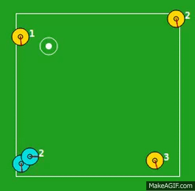
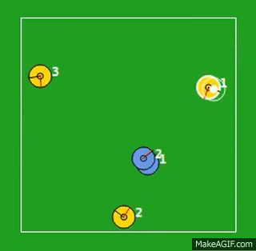

# RoboCup Keepaway benchmark player framework
[](https://travis-ci.org/aijunbai/keepaway)

## Concurrent HAMQ Learning
This ongoing project demonstrates a **concurrent partial program** approach to the RoboCup Keepaway task. More details can be found in:
-   **Efficient Reinforcement Learning with Hierarchies of Machines by Leveraging Internal Transitions**, *Aijun Bai*, and Stuart Russell,\
    *Proceedings of the Twenty-Fifth International Joint Conference on Artificial Intelligence (**IJCAI**), Melbourne, Australia, August 19 - 25, 2017.*
    \[[pdf](https://aijunbai.github.io/publications/IJCAI17-Bai.pdf)\]
    \[[bib](https://aijunbai.github.io/publications/IJCAI17-Bai.bib)\]
-   **Concurrent Hierarchical Reinforcement Learning for RoboCup Keepaway**, *Aijun
    Bai*, Stuart Russell, and Xiaoping Chen,\
    *RoboCup-2017: Robot Soccer World Cup XX, Lecture Notes in
    Artificial Intelligence (**RoboCup**), Springer Verlag, Berlin, 2017.*
    \[[pdf](https://aijunbai.github.io/publications/LNAI17-Bai.pdf)\]
    \[[bib](https://aijunbai.github.io/publications/LNAI17-Bai.bib)\]
    
### Before learning
[](https://www.youtube.com/watch?v=GFd0b3wV0Rk "initial policy")

### After learning
[](https://www.youtube.com/watch?v=ob249J8Kxi0 "converged policy")

## Install
- ```sudo add-apt-repository ppa:gnurubuntu/rubuntu```
- ```sudo apt update```
- ```sudo apt install rcssserver rcssmonitor rcsslogplayer```
- ```git clone https://github.com/aijunbai/keepaway```
- ```cd keepaway```
- ```make release```

## Usages
- Train a group of keepers using SARSA: ```./train.sh [-g GAMMA] [-L LAMBDA] [-A ALPHA] [-I INITIALWEIGHT] [-l] [-f] [-m] [-s]```
   - ```-g GAMMA```: specify the discount factor [default: 1.0]
   - ```-L GAMMA```: specify the Lambda constant [default: 0.5]
    - ```-A ALPHA```: specify the learning rate [default: 0.125]
    - ```-I INITIALWEIGHT```: spefify the initial weight for inner Q tables [default: 0.5]
    - ```-l```: turn on logging for ```keepaway_player``` and ``rcssserver``` [default: false]
    - ```-f```: turn on fullstate perception within ```rcssserver``` [default: true]
    - ```-m```: launch a monitor, technically ```rcsssmonitor``` [default: true]
    - ```-s```: turn on synch mode within ```rcssserver``` [default: true]
- Evaluate a learned policy by simulation: ```./evaluate.sh QFILE```
   - ```QFILE```: learned Q file for keepers
- Train a set of groups simultaneously with random hyperparameters: ```./batch-train.sh```
- Evaluate a set of learned policies simultaneously: ```./batch-evaluate.sh QFILES...```
 
One learned policy is included in the ```data``` directory for reference. It can be evaluated by running: ```./evaluate.sh data/keeper_Q_g1._l0.227_a0.09_w0.346_fsm.gz```

## Related Project
- HAMQ and HAMQ-INT on standard Taxi domain: [https://github.com/aijunbai/taxi](https://github.com/aijunbai/taxi)


# Old READMEs

This project is intended as a public but unofficial repository for updates to
the Keepaway benchmark player framework created at UT Austin by Gregory
Kuhlmann and Peter Stone.

The intention is that this project can serve as a source for updates and
compatibility with ongoing changes to the RoboCup Soccer Server. However, no
promises are made as to the fitness of this software for any purpose
whatsoever.

I have also modified the launch scripts to expect working with in-place builds
of rcss tools rather than system installed ones. The latter might still work,
but I haven't checked on that. I expect sibling dirs to keepaway called
rcssmonitor_qt4 and rcssserver. Use the keepaway.py launch script for most
convenience. I haven't done much to maintain the original keepaway.sh. As an
example, to kick off with default settings and see the action, run like so (if
your system has python and knows shebangs):

```
./keepaway.py --monitor
```

The original README from Gregory Kuhlmann and Peter Stone follows. Following
that is the original README for the learning code, including the list of
contributors to that code base. See these READMEs also for papers to reference
when using this code.

Also included in this combined code base is the Tile Coding Software version 2
from Richard S. Sutton, included with permission from him. This software, as
well as more recent versions, is also available directly from the author
(http://webdocs.cs.ualberta.ca/~sutton/tiles2.html).

The combined, updated code base has also included assistance from Stephen Kelly
(initial integration of learning code) and Luiz Celiberto (my updates in support
of latest rcss and gcc checked against his), among others.

I have also made some minimal changes to support dynamic loading of shared
library code for agent behavior, thus avoiding the need to change the original
code. See the "ext=" hackery in main.cc for more details.

- Tom Palmer

-------------------
README for Keepaway
-------------------

This package contains the source code for the Keepaway benchmark 
player framework and the source code for some keepaway utility
programs.  The framework includes all low- and mid-level keepaway
behaviors.  A few example high-level policies are included.  Not
included is any learning code.  However, the framework was designed
to make it easy to insert your own learning code.  Also, not included
is the soccer simulator (see REQUIREMENTS).

The framework was created by

 Gregory Kuhlmann
 and Peter Stone

in the Department of Computer Sciences
at the University of Texas at Austin:
http://www.cs.utexas.edu/~AustinVilla/sim/keepaway/

Copyright 2004 Gregory Kuhlmann, Peter Stone
All Rights Reserved

This package was created as part of our research using
the keepaway domain.  The following is a list of selected 
publications:

Keepaway Soccer: From Machine Learning Testbed to Benchmark.
Peter Stone, Gregory Kuhlmann, Matthew E. Taylor, and Yaxin Liu.
In Itsuki Noda, Adam Jacoff, Ansgar Bredenfeld, and Yasutake Takahashi, editors, 
RoboCup-2005: Robot Soccer World Cup IX, Springer Verlag, Berlin, 2006.

Reinforcement Learning for RoboCup-Soccer Keepaway.
Peter Stone, Richard S. Sutton, and Gregory Kuhlmann.
Adaptive Behavior, 2005. 

These and other keepaway papers can be found here:
http://www.cs.utexas.edu/~pstone/Papers/bib2html/

We ask that you please cite these papers if you publish work that builds
off of this framework.

The players are built upon version 3.3 of the UvA Basic team that is 
publicly available from:
http://staff.science.uva.nl/~jellekok/robocup/2003/index_en.html

The communication code is based on:
saymsglib - a library to generate and parse messages in the Coachable agent
communication standard created by Carnegie Mellon University.  It is 
described here:
http://www-2.cs.cmu.edu/~robosoccer/simulator/comm_standard.html

We provide this code as-is with no support implied.
It has been tested under Debian Linux 3.1 (testing)

REQUIREMENTS:

The RoboCup Soccer Server, available from:
http://sserver.sf.net

The following package versions are strongly recommended:
  rcssbase    9.4.5
  rcssserver  9.4.5
  rcssmonitor 9.3.7

Gnuplot (optional)


FILES and DIRECTORIES:

```
README        - This file
COPYING       - GNU Public License
keepaway.sh   - script to start players
player/       - keepaway player source code
logs/         - dir to store generated log files (initially empty)
weights/      - dir to store learned weights (initially empty)
tools/        - some useful utilities for keepaway experiments
```


INSTALLATION:

In player/:
```
make depend
make
```

In tools/:
```
make
```
(copy all binaries to some directory in your PATH)


USAGE:

(Modify "keepaway_dir" in keepaway.sh to match installation dir)
```
./keepaway.sh
```

To view players:
```
monitor
```

To stop:
```
killserver
```


---------------------------------
README for Keepaway learning code
---------------------------------

This package contains the learning code to accompany the Keepaway
benchmark player framework.

This is a particular snapshot of the code, and different published
results have used different learning algorithms.  We don't guarantee
that this particular instantiation will line up with all of the
published papers using keepaway.  Variations on the learning algorithm
are described in the papers indexed here:
http://www.cs.utexas.edu/~pstone/Papers/bib2html/

We provide this code as-is with no support implied. This code has not
been tested and we make no guarantees that it will even compile.

The learning code was created by

 Peter Stone
 Gregory Kuhlmann
 Matthew E. Taylor
 Yaxin Liu
 and Shivaram Kalyanakrishnan

in the Department of Computer Sciences
at the University of Texas at Austin:
http://www.cs.utexas.edu/~AustinVilla/sim/keepaway/

This package was created as part of our research using
the keepaway domain.  The following is a list of selected 
publications:

Keepaway Soccer: From Machine Learning Testbed to Benchmark.
Peter Stone, Gregory Kuhlmann, Matthew E. Taylor, and Yaxin Liu.
In Itsuki Noda, Adam Jacoff, Ansgar Bredenfeld, and Yasutake Takahashi, editors,
RoboCup-2005: Robot Soccer World Cup IX, Springer Verlag, Berlin, 2006. To
appear.

Reinforcement Learning for RoboCup-Soccer Keepaway.
Peter Stone, Richard S. Sutton, and Gregory Kuhlmann.
Adaptive Behavior, 2005. 

We ask that you please cite these papers if you publish work that builds
off of this code.

The players are built upon version 3.3 of the UvA Basic team that is 
publicly available from:
http://staff.science.uva.nl/~jellekok/robocup/2003/index_en.html

The communication code is based on:
saymsglib - a library to generate and parse messages in the Coachable agent
communication standard created by Carnegie Mellon University.  It is 
described here:
http://www-2.cs.cmu.edu/~robosoccer/simulator/comm_standard.html

REQUIREMENTS:

The Keepaway Player Framework
http://www.cs.utexas.edu/~AustinVilla/sim/keepaway/

The RoboCup Soccer Server, available from:
http://sserver.sf.net
